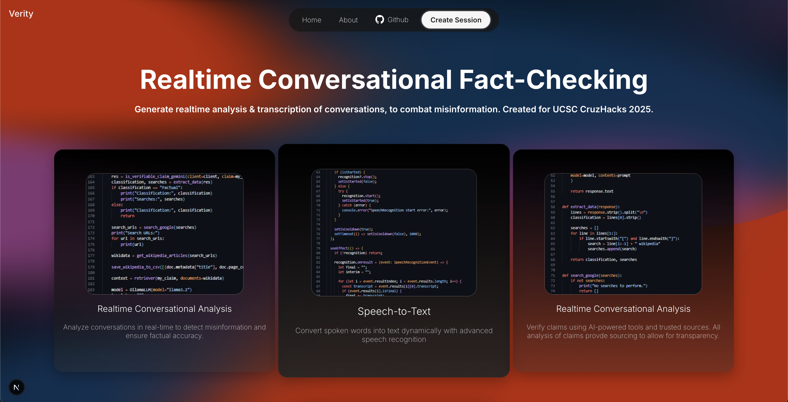
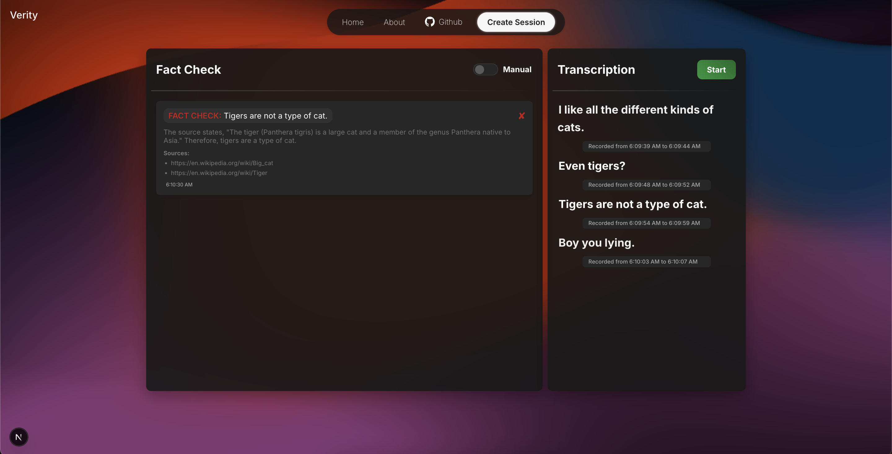

# Verity - Realtime Fact-Checking & Conversational Analysis

Verity is a powerful web application designed to streamline the job application process. Verity combats misinformation through realtime retreival of sourced data, which is analyzed and applied to specific claims made during a conversation. The platform encourages research and sourcing claims, improving conversation productiveness and establishing baseline truths to arguments.

With Verity, users can get a realtime transcription of their conversation, analyze specific claims made, and get personalized feedback regardinging the validity of claims.


## 📸 Screenshots


_Home Page_


_Interface for live conversational analysis_


## 🚀 Getting Started

### Prerequisites

- Node.js (v15.1.5 or higher)
- npm or yarn
- Python 3.7

### Installation

1. Clone the repository:

   ```bash
   git clone https://github.com/yourusername/speedfill.git
   cd cruzhacks2025
   cd frontend
   ```

2. Install dependencies:

   ```bash
   npm install
   # or
   yarn install
   ```

3. Create a [\\.env\\.local](.env.local) file in the root directory and add your API keys:

   ```
   GEMINI_API_KEY = "YOUR KEY"
   GOOGLESEARCH_API_KEY = "YOUR KEY"
   ```

4. Run the development server:

   ```bash
   npm run dev
   # or
   yarn dev
   ```

5. Open [http://localhost:3000](http://localhost:3000) in your browser to view the application.

## 🛠️ Technology Stack

- **Frontend:** React.js, Next.js
- **AI Integration:** Google Gemini AI API, Ollama+Langchain Retreiver Models (nomic-embed-text)
- **Backend API** Flask
- **Languages** Python, TypeScript, HTML/CSS


## 📜 License

This project is licensed under the MIT License - see the [`LICENSE`](LICENSE) file for details.
